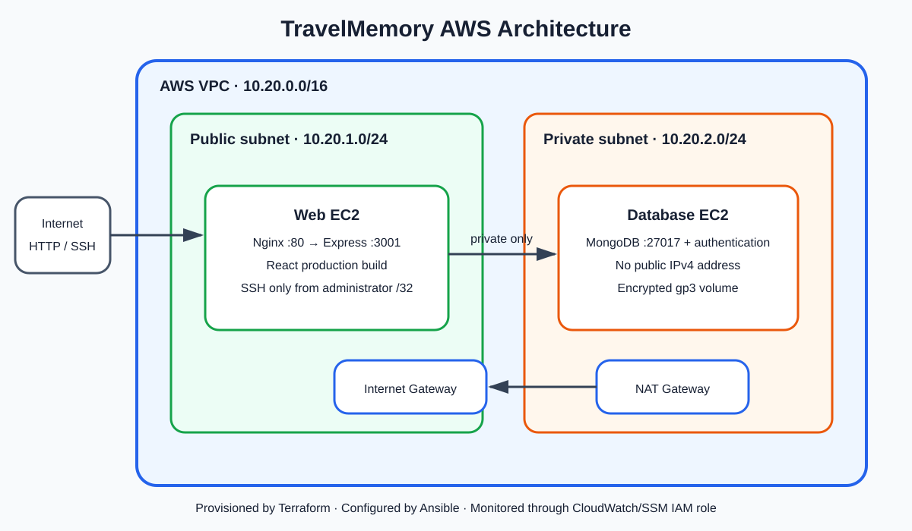

# Implementation Report: TravelMemory on AWS

## 1. Executive summary

This project deploys the prescribed TravelMemory MERN application to AWS using Terraform for infrastructure provisioning and Ansible for operating-system configuration and application deployment. The architecture deliberately matches the assignment: one internet-facing web instance and one isolated database instance. The implementation adds defense-in-depth controls, repeatable automation, validation, and cost-aware cleanup.

## 2. Architecture

The VPC uses `10.20.0.0/16`. The web server is in public subnet `10.20.1.0/24`, obtains a public IPv4 address, and reaches the Internet through an Internet Gateway. The MongoDB server is in private subnet `10.20.2.0/24`, has no public address, and uses a NAT Gateway only for outbound package installation. Ansible reaches MongoDB by tunnelling SSH through the web server.

User requests arrive on TCP 80 at Nginx. Nginx serves the React production bundle and reverse-proxies `/trip` and `/hello` to Express on loopback port 3001. Express connects across the private VPC network to authenticated MongoDB on port 27017. The database security group accepts MongoDB and SSH traffic only from the web security group.

## 3. Terraform implementation

Terraform discovers the latest official Canonical Ubuntu 22.04 AMI and provisions the following resources:

- VPC with DNS support and hostnames enabled.
- Public and private subnets in one Availability Zone.
- Internet Gateway, Elastic IP, NAT Gateway, and separate route tables.
- Web and database security groups implementing least network access.
- Two `t3.micro` EC2 instances with encrypted gp3 volumes, detailed monitoring, and mandatory IMDSv2 tokens.
- EC2 IAM role and instance profile using AWS-managed SSM and CloudWatch Agent policies.
- A local generated Ansible inventory containing host addresses and bastion configuration.

Inputs are declared and validated in `variables.tf`; environment-specific values belong in ignored `terraform.tfvars`. Outputs include the required web public IP and application URL.

## 4. Ansible implementation

The `common` role updates package metadata, installs baseline tools, enables unattended security updates, disables SSH root/password login, and establishes deny-by-default UFW policy.

The `mongodb` role installs MongoDB 7 from its signed official repository, binds it only to loopback and the private interface, enables authorization, creates separate administrative and application users, starts the service at boot, and permits port 27017 only from the web host. Passwords are provided through controller environment variables and protected with `no_log`.

The `web` role installs Node.js 20, NPM, and Nginx; creates an unprivileged service account; clones TravelMemory; installs locked dependencies; writes the protected backend environment; builds React with the public backend URL; and installs a hardened systemd service. Nginx serves the frontend, proxies the backend, supports React client-side routes, and adds basic security headers.

## 5. Application interaction

1. A browser downloads the React static bundle from Nginx.
2. React sends HTTP requests to `/trip` on the public web address.
3. Nginx proxies those routes to Express at `127.0.0.1:3001`; Express is not directly Internet-accessible.
4. Mongoose uses the private MongoDB address and the least-privilege `travel_app` credentials.
5. MongoDB persists trip documents on its encrypted EC2 root volume and returns results to Express, Nginx, and the browser.

## 6. Security controls

- Administrator SSH is restricted to one supplied public CIDR; `0.0.0.0/0` is rejected by validation.
- The private EC2 instance has no public IP and is reached through an SSH bastion.
- MongoDB authorization is enabled, and the application does not use the administrative account.
- Secrets, private keys, state, generated inventory, and variable files are excluded from Git.
- EC2 metadata requires IMDSv2; EBS is encrypted; root/password SSH are disabled.
- UFW duplicates the AWS security-group boundaries as host-level defense.
- The Node.js process runs as an unprivileged system account under systemd hardening.

Residual limitations: plain HTTP remains because there is no assignment domain/certificate; a single Availability Zone and single database are not highly available; the assignment design does not include automated backups. These should be addressed for production.

## 7. Deployment and verification procedure

After AWS CLI authentication and EC2 key creation, populate `terraform.tfvars` and run `scripts/deploy.sh`. The script validates and applies Terraform, creates local strong passwords, installs the required Ansible collection, executes the playbook, and checks `/hello`. The separate validation script verifies the React HTML, Express response, and MongoDB-backed `/trip/` path.

Record screenshots according to the evidence checklist. Evidence must come from the real AWS deployment. Finally, destroy resources to stop NAT Gateway and EC2 billing.

## 8. Expected results and acceptance criteria

- Terraform apply completes with two EC2 instances and prints `application_url`.
- The Ansible recap shows zero unreachable or failed hosts.
- The application opens at the output URL and supports adding and displaying a trip.
- The database instance has only a private IP.
- Direct Internet access to ports 3001 and 27017 is blocked.
- Validation prints PASS for frontend, backend, and MongoDB path.

### Verified deployment result — 30 August 2026

- Application URL: `http://13.233.113.78`
- Web private IP: `10.20.1.112`
- Database private IP: `10.20.2.108`
- Terraform infrastructure applied successfully in `ap-south-1`.
- Final idempotency run: database `ok=19 failed=0`; web `ok=29 failed=0`.
- `/hello` returned `Hello World!`; `/trip/` returned persisted MongoDB data.
- A sample **Incredible India** experience was added and displayed through React.

## 9. Evidence register

The architecture diagram is included now. Cloud and application screenshots must be captured after deployment and placed in `docs/screenshots` using the numbered filenames in its README. This report intentionally does not claim that unexecuted cloud resources or fabricated screenshots are deployment evidence.

## 10. Cost and cleanup

The main short-lived costs are two EC2 instances, EBS, public IPv4, and especially the hourly NAT Gateway plus processed data. Execute `scripts/destroy.sh` immediately after assessment evidence has been captured, then confirm in the AWS console that no project NAT Gateway, Elastic IP, or EC2 instance remains.
